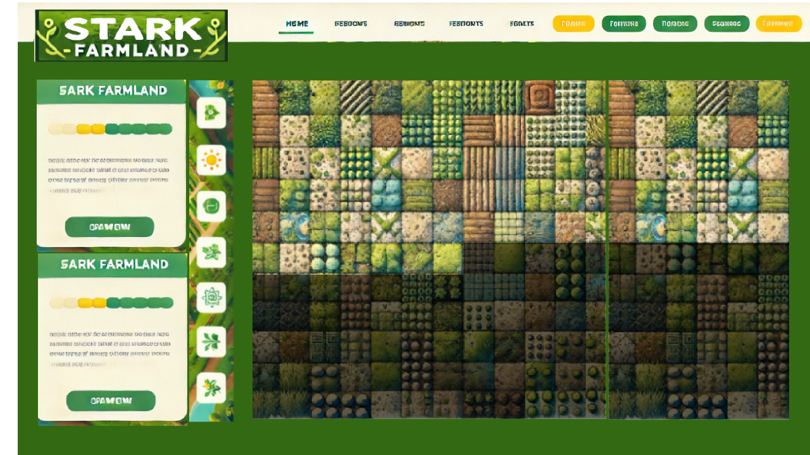

## Task
1. UI might be look like

    - navbar logo, some interface button(dashboard, player, ...) not need to enter in, just decoration, connect wallet.
    - left bar(game compoents detail) 
    - - (top) user detail: seed amount, fruit amount, 
Countdown to next watering, Countdown to the next prank.......
    - - (below) land detail: when player click the land, it will show the detail of this land, owner, current growth status(picture), countdown to next watering, havest?

    - - right bar(land): it shows all user land, so need to think about how to separate them with visual effects, user can manager their own land, and when he click others' land, in the land detail, he can help them water with (watering_others), and can prank them too,(but now didnt have this function in smart contract, so maybe it is a fake button, and show our idea). And exist land will be normal color and not exist land will be dark, you can find the bigest index of land with below code, it is in land variable. And in the first dark land, there is a "+" button on it, it represent the `add land` button, add a new land for the user.


        ```
        import { Has } from '@dojoengine/recs';
        const treeManager = useComponentValue(TreeManager, ('0x1d3059abe3d5b6c913be8a29d9614dd97494e068c7c7b53b22962bbd815049d') as Entity)

        const landManager = useComponentValue(LandManager, ('0x7ab7449f04ef02fae040abb7d86e4598d6bc4f738616ad3c98a04e06b67a8b2') as Entity)

        const land = useEntityQuery([Has(LandManager)]);
        console.log(land);
        ```

2. connect to wallet(hard)
    
    ``` 
    //
     export const dojoConfig = createDojoConfig({
    //     manifest,
    //     toriiUrl: "https://api.cartridge.gg/x/farmlandtest/torii",
    //     rpcUrl: "https://api.cartridge.gg/x/farmlandtest/katana",

    //     masterAddress: "0x55394e7e41cfa72bc185cfaae17b46125ab2e35d146b45d2f27f4438ecf4be5",
    //     masterPrivateKey: "0x188b9005f79d818d311ca607940b10a674fb78671c7bd496b28c06c14db9e32",
    // });
    ```

3. ppt presentation + demo video

4. submit the project 
    - `Project Edittor` If you deploy it on vercel, fill the demonstration. If you connect wallet successful, add the technologies of dynamic in the words. 

    - `Media Upload` get some screenshot of page and replace the picture in . 